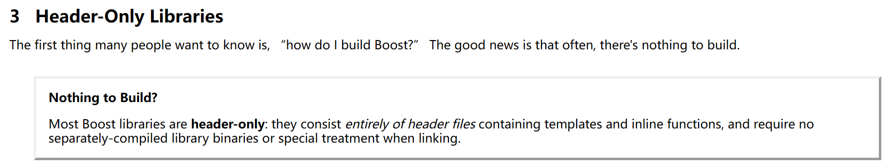

# 安装

[下载地址与教程](https://www.boost.org/doc/libs/1_83_0/more/getting_started/windows.html#link-your-program-to-a-boost-library)  

介绍：
boost库是c++第三方库
开源，跨平台，被称为c++“ 准 ”标准库， 作为c++的标准库的扩展使用

该库分为两部分：
一部分是header-only库
一部分是separately-compiled库

header-only：

ps:
这里我们用到了asio这个内涵在boost中的库
但是该库依赖boost.system这个库，因此需要将boost编译后才可链接
详情请看上面的下载地址与教程。
[编译boost教程](https://gist.github.com/sim642/29caef3cc8afaa273ce6)配合上面的教程一起食用即可(注意编译工具！！！)

